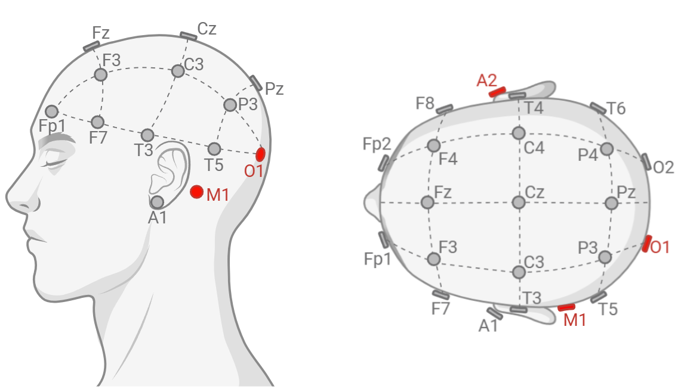
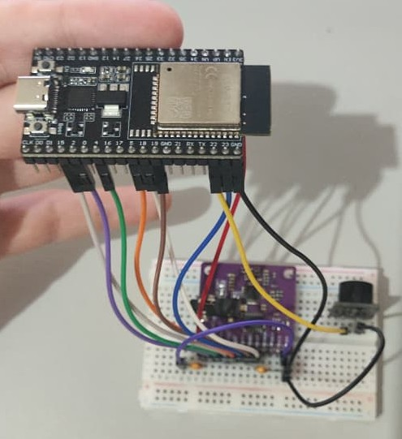
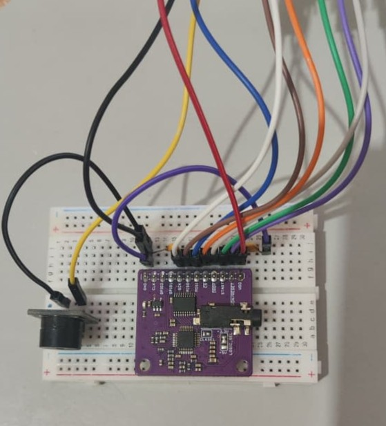
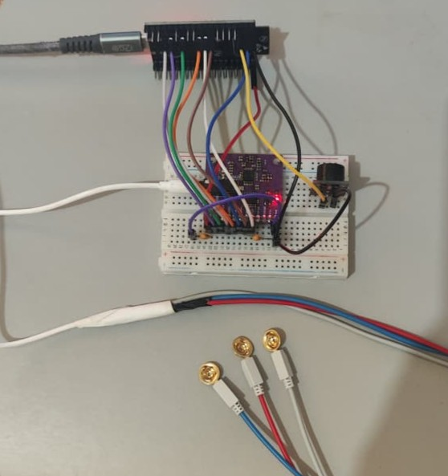

# EEG_from_scratch

A cost-effective, open-source system for capturing single-channel EEG signals, primarily designed for eyes closed/open detection. The system uses an ESP32 microcontroller interfaced with an ADS1292R ADC module via SPI for signal acquisition, with a user-friendly GUI for real-time monitoring, signal processing, and frequency band analysis. This first prototype serves as a base for a future intended expansion to affordable 8-channel EEG acquisition using the ADS1299 chip and proper PCB design.

## Project Overview

**Main Objectives:**

- Capture raw EEG signals from a single channel with 24-bit resolution
- Provide real-time signal processing with digital filters
- Perform frequency band analysis (Delta, Theta, Alpha, Beta, Gamma)
- Detect eyes open/closed states based on EEG band power thresholds
- Support signal simulation, recording playback, and live hardware acquisition
- Enable impedance testing for electrode placement verification

**Hardware Components:**

This project uses an ESP32 microcontroller (SPI master), ADS1292R module (SPI slave, typically for ECG/EEG), passive electrodes or commercial EEG electrodes, a buzzer module (optional, for state notifications), and supporting passive components (capacitors). See [Bill of Materials](bom/README.md) for details.

## Safety Disclaimer

**IMPORTANT:** This project is intended for educational and research purposes only. It must not be used for medical diagnosis or clinical applications. Electrodes should only be connected to battery-powered electronics and should not be used while charging laptops or main-powered devices unless proper galvanic isolation is implemented.

## Project Structure

```
EEG_from_scratch/
│
├── main.py                        # Launch the GUI application
├── README.md                      # This documentation file
│
├── acquisition/                   # EEG signal acquisition and recording playback
│   ├── config_acquisition.py      # ADS1292R configuration and serial communication
│   ├── load_recording.py          # Load and replay recorded EEG CSV files
│   ├── simulate_acquisition.py    # Generate synthetic EEG signals for testing
│   └── recordings/                # Directory for storing and replaying EEG recordings (CSV format)
│
├── buffer/                        # Real-time circular data buffer
│   └── data_buffer.py             # Manages streaming sample storage with configurable sample rate
│
├── signal_processing/             # Digital signal processing pipeline
│   ├── signal_processor.py        # Applies digital filters and computes frequency band power
│   └── fft_calculation.py         # FFT-based spectral analysis
│
├── GUI/                             # PySide6-based graphical user interface
│   ├── main_window.py               # Main application window with dock widgets
│   ├── signal_visualization.py      # Real-time waveform plotting
│   ├── fft_plotter_widget.py        # FFT spectrum visualization
│   ├── band_power_widget.py         # Frequency band power display
│   ├── band_detector_widget.py      # Threshold-based band power detection (for eyes closed detection)
│   ├── processing_controls.py       # Filter and processing parameter adjustment
│   ├── config_acquisition_dialog.py # ESP32 connection and ADC parameter configuration
│   ├── load_file_dialog.py          # File browser for recording playback
│   ├── create_simulation_dialog.py  # Synthetic signal generation parameters
│   ├── dock_widget.py               # Reusable dock widget container
│   └── icons/                       # Icon files for UI buttons
│
├── utl/                           # Utility functions and data structures
│   └── data.py                    # Acquisition parameters, ADC value converters
│
├── ESP32/                         # ESP32 firmware (Arduino IDE compatible)
│   └── esp_to_ads1292r.c          # Firmware for ADS1292R control via SPI and buzzer activation
│
└── bom/                           # Hardware documentation
    └── README.md                  # Bill of materials and component specifications
```

## Hardware Setup

### 1. Electrode Placement on Scalp

EEG electrodes are positioned using the **10-20 system**, a standardized scalp mapping:

- **Signal electrode (O1)**: Left occipital lobe, located approximately 1 inch (2.5 cm) above the left ear and 1 inch to the left of the midline. This location is sensitive to alpha rhythm activity (8–12 Hz), the primary indicator of the eyes-closed state.
- **Reference electrode (A2)**: Right earlobe, the reference.
- **Ground electrode (M1)**: Left mastoid, used for bias/ground - improves noise rejection.

<p align="center">
   
</p>

### 2. Electrode Wires to Jack Pin Connections

The electrodes connect to a 3.5 mm stereo jack as follows:

| Electrode  | Jack Pin       | Description              |
|------------|----------------|--------------------------|
| Signal (O1)    | Tip (1)        | EEG signal input         |
| Reference (A2) | Ring (2)       | Reference input          |
| Ground (M1)    | Sleeve (3)     | System ground/bias       |

Secure connections are critical to signal quality. Check the stability and isolation of wire solderings, as well as their continuity.

After correctly wired, the jack pin connects to the ADS1292R breakout board through the female pin entrance.

### 3. ADS1292R Module Soldering Instructions

There are plenty of different modules for the ADS1292R chip. The most common breakout board, and the one used for this project ([AliExpress](https://www.aliexpress.com/item/3256805267039105.html)) requires additional soldering before integrating with the ESP32:

- Solder pin headers with pinout holes to the board
- **LOGIC_SEL** (three metal pads, if available): Set to 3.3V by bridging the middle pad to the pad marked with `3.3V`
- **CLK_SEL** (three metal pads, if available): Set to use internal clock by bridging the middle pad to 3.3V or VDD (double-check in your module documentation if logic high or low to select it, but it's usually high). If no markdown is written, measure the side pads with a multimeter.

### 4. Wiring Diagram: ADS1292R ↔ ESP32 + Buzzer

**SPI Interface:**

| ADS1292R Pin | ESP32 Pin | Wire Function          |
|--------------|-----------|------------------------|
| VDD          | 3.3 V     | Power Supply           |
| GND          | GND (any) | Power Supply           |
| CS           | GPIO 5    | Chip Select (active low) |
| SCK          | GPIO 18   | Serial Clock           |
| MOSI         | GPIO 23   | Master Out, Slave In (data to ADS) |
| MISO         | GPIO 19   | Master In, Slave Out (data from ADS) |
| DRDY         | GPIO 15   | Data Ready interrupt (active low) |
| START        | GPIO 4    | Start conversion signal |
| RESET        | GPIO 2    | Reset signal (active low) |

<p align="center">
  
  
</p>

**Buzzer Connection:**

- **Buzzer Signal**: GPIO 22 (PWM compatible)
- **Buzzer GND**: Common ground

**Decoupling Capacitors (important for noise rejection):**

- **100 nF ceramic**: Between VDD and GND at ADS1292R (place it in the same holes as the jumper pin)
- **47 pF ceramic**: Between GND and MOSI (same holes as the jumper pin)

**Everything put togheter**:

<p align="center">
   
</p>

---

## Software Setup & Execution

### 1. Create Python Virtual Environment

**Requirements**: Python 3.8 or newer

#### **Windows**

```powershell
python -m venv .venv
.\.venv\Scripts\Activate.ps1
python.exe -m pip install --upgrade pip
pip install -r requirements.txt
```

#### **Linux (Ubuntu/Debian)**

```bash
sudo apt-get update
sudo apt-get install -y python3-dev python3-pip python3-venv libgl1-mesa-glx libxkbcommon-x11-0
python3 -m venv .venv
source .venv/bin/activate
pip install --upgrade pip
pip install -r requirements.txt
```

#### **macOS**

```bash
/bin/bash -c "$(curl -fsSL https://raw.githubusercontent.com/Homebrew/install/HEAD/install.sh)"
python3 -m venv .venv
source .venv/bin/activate
pip install --upgrade pip
pip install -r requirements.txt
```

### 2. Upload ESP32 Firmware

**Prerequisites**: Arduino IDE must be installed and configured for ESP32. Follow this tutorial if not already set:
[ESP32 with Arduino](https://www.youtube.com/watch?v=ikBlhX-erSw)

Then:

1. Open Arduino IDE
2. Go to File → Open and load `ESP32/esp_to_ads1292r.c`
3. Select Tools → Board and choose your ESP32 board (e.g., "ESP32 Dev Module")
4. Select Tools → Port and choose the COM port corresponding to your ESP32
5. Set Tools → Upload Speed to `115200`
6. Click the Upload button
7. Wait for "Connecting..." to appear and hold `boot` button on ESP32 until it starts uploading

**Troubleshooting**: If upload fails, disconnect VDD from ESP32 to the ADS module and try again. Reconnect once upload is done.

### 3. Launch the GUI Application

Make sure your virtual environment is activated before running the application.

From the project root directory, run:

```bash
python main.py
```

A new window will open with the EEG application interface.

### 4. GUI Features & Workflow

The GUI can be used for three main purposes: live acquisition using the ESP32 (main function), simulate an acquisition (noised alpha signal with 50 Hz interference), and replay an EEG recording from [recordings](acquisition/recordings/).

#### **Live Acquisition: Connection & Configuration**

1. Click the "signal icon" (**Configure Live Acquisition** button) in the toolbar to open ADC Configuration dialog
2. The dialog will auto-detect your ESP32 COM port (e.g., `COM5` on Windows)
3. If not found, click the rotational arrow to try detecting again until it appears
4. Click **Connect** to establish serial communication

Once connected:

5. Adjust ADC parameters in the configuration dialog:
   - **Sample Rate**: 250 Hz (recommended for EEG) or 500 Hz, 1000 Hz
   - **Gain**: 6 (default, good for typical electrode impedances 5–100 kΩ)
   - **Test Signal**: Enable to verify signal chain with internal test waveform (will ignore the electrodes, good for troubleshooting)
   - **Lead-Off Detect**: Enable to detect open/shorted electrodes during acquisition (GUI feedback not implemented yet)
6. *(Optional)* Click **Test Electrode Impedance** to verify electrode contact:
   - Good impedance: < 5 kΩ (displayed in green)
   - Acceptable: 5–20 kΩ (orange)
   - Poor: > 20 kΩ (red) — reposition electrodes or clean contacts
   - Check details in `Impedance Testing` section below
7. Click **Ok** and wait for the interface to appear
8. Click **Play** to start acquisition
9. Click **Stop** to halt acquisition
10. *(Optional)* Save the acquisition recording by pressing the **Save** button and giving it a file name (.csv by default).

#### **Signal Simulation**

To test the GUI without hardware:

1. Click the "graph icon" (**Simulate Acquisition** button) in the toolbar to open Create Simulation dialog
2. Select simulation parameters:
   - Sample Rate (Hz)
   - Number of channels (signals will be copied to every channel)
   - Window Time: e.g., 10 seconds
3. Click **Ok**
4. Use the **Play** button to stream the simulation into the processing pipeline

#### **Replay Recorded Signals**

To analyze previously recorded EEG (3 files already there as examples):

1. Click the **"open folder icon"** in the toolbar
2. Click the `...` button and navigate to `acquisition/recordings/` folder
3. Select a CSV file (e.g., `S1.csv`)
4. Select sample rate (if greater than the actual file, will interpolate) and channels. Default will use the file as is
5. Click **Ok**, then playing the recording will stream through the pipeline as if it were live

#### **Signal Processing Controls**

This widget displays checkboxes and sliders for real-time parameter adjustment:

- ☐ **Notch Filters (50/60 Hz)**: Removes AC main interference from powerlines
- ☐ **Band-Pass Filters (0.5-100 Hz)**: Removes DC drift, very low-frequency artifacts and attenuates high-frequency noise. After checking the box, use the sliders to select the Low and High frequencies to filter from
- **Time Window Slider**: Changes the signal time window displayed at Raw/Processed Signal widgets

#### **Frequency Band Detection & Eyes-Closed State**

The **Band Detector** widget is the key for eyes-closed detection:

1. **Band Selection** (Dropdown): Choose which frequency band to monitor
   - **Delta** (0.5-4 Hz): Sleep-related, high during sleep
   - **Theta** (4-8 Hz): Drowsiness and meditation
   - **Alpha** (8-12 Hz): **Use this for eyes-closed detection**
   - **Beta** (12-30 Hz): Alert, focus state
   - **Gamma** (30-100 Hz): Active processing (noisy, not recommended)

2. **Channel Selection** (Dropdown): Monitor a specific channel or average across all channels

3. **Threshold Slider**: Adjusts the power threshold
   - The value represents the fraction of power of that band and channel(s) from the entire Density Power Spectrum (DPS)
   - The **green indicator** lights when the selected band exceeds the threshold, also emitting the High signal to the buzzer

4. **Power Bar**: Real-time visualization of the selected band power relative to threshold

5. **For Eyes-Closed Detection**:
   - Band: **Alpha**
   - Channel: **All (Average)**
   - Apply the correct **Notch Filter** depending on your country
   - Apply **High-Pass (0.5 Hz)** and **Low-Pass (40 Hz)** filters
   - Threshold: Adjust until the green light activates when you close your eyes and dims when you open them (0.6 is a good starting value)

---

## Impedance Testing

The ADS1292R includes a built-in **lead-off detection circuit** that measures electrode impedance:

1. In the **ADC Configuration** dialog, click **Test Electrode Impedance**
2. The system will run a non-invasive AC measurement at ~125 Hz (for 500 SPS mode)
3. Results appear as:
   - **Channel 1 impedance**: for electrode pair CH1P/CH1N - **IGNORE**: not set using the breakout board module we're currently using - that's why we can only acquire single-channel EEG with this setup
   - **Channel 2 impedance**: for the electrode pair CH2P/CH2N - the actual differential signal between O1 and A2

| Impedance Range | Quality | Action                       |
|-----------------|---------|-------------------------------|
| < 5 kΩ          | Excellent | Ready for acquisition         |
| 5–20 kΩ         | Good      | Acceptable; may add gain      |
| 20–50 kΩ        | Fair      | Clean electrode, adjust placement |
| > 50 kΩ         | Poor      | Re-apply gel, check contacts  |

---

## Troubleshooting

| Issue | Possible Cause | Solution |
|-------|----------------|----------|
| `AttributeError: '_SixMetaPathImporter' object has no attribute '_path'` (Python 3.12) | Outdated package versions incompatible with Python 3.12 | Remove venv then recreate it and run `pip install -r requirements.txt` or downgrade Python version to 3.11- |
| ESP32 not detected | No serial port found | Check USB cable, install CH340/CP210x driver, restart IDE |
| "Connection Failed" | Serial port already in use | Close other applications accessing the COM port |
| High impedance (>20 kΩ) | Poor electrode contact | Clean the skin, apply conductive gel, ensure firm scalp contact |
| Weak Alpha signal | Electrode placement/High noise | Move O1 electrode closer to occipital region and make sure filters are checked |
| Buzzer not activating | GPIO 22 wiring/wrong Buzzer pin | Verify wiring, check ADS1292R command transmission |

---

## References & Further Reading

- **ADS1292R Datasheet**: [Texas Instruments](https://www.ti.com/lit/ds/symlink/ads1292r.pdf)
- **10-20 Electrode System**: [EEG Electrode Placement](https://en.wikipedia.org/wiki/10–20_system_(EEG))
- **Closed and Open Eyes EEG Data**: [Dataset](https://doi.org/10.5281/zenodo.10168535)

---

## License

See [LICENSE](LICENSE) file for details.
